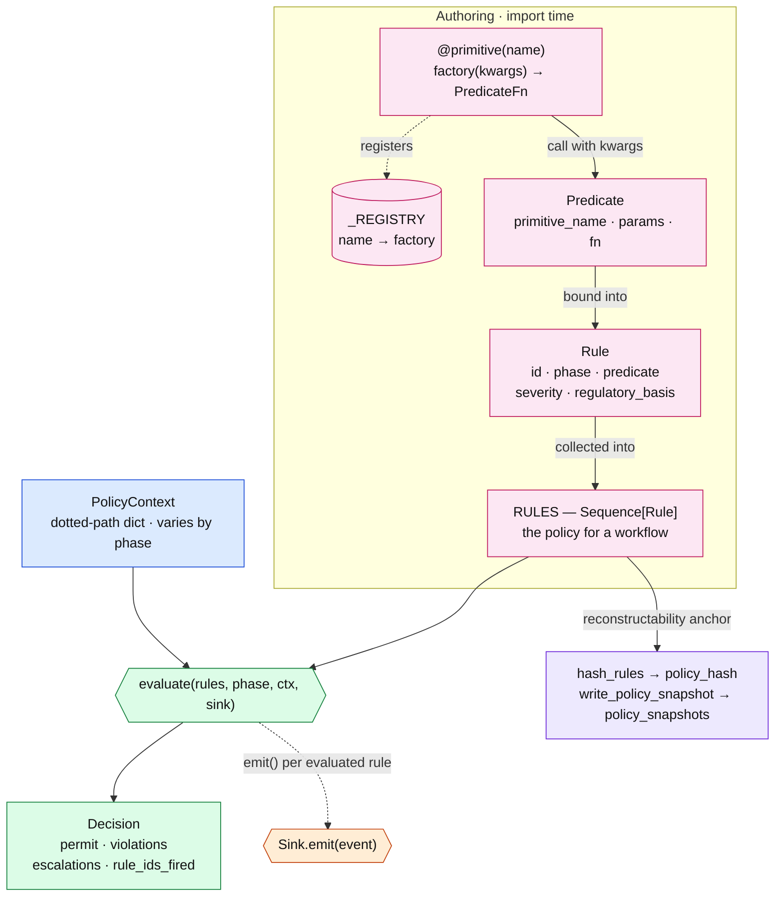
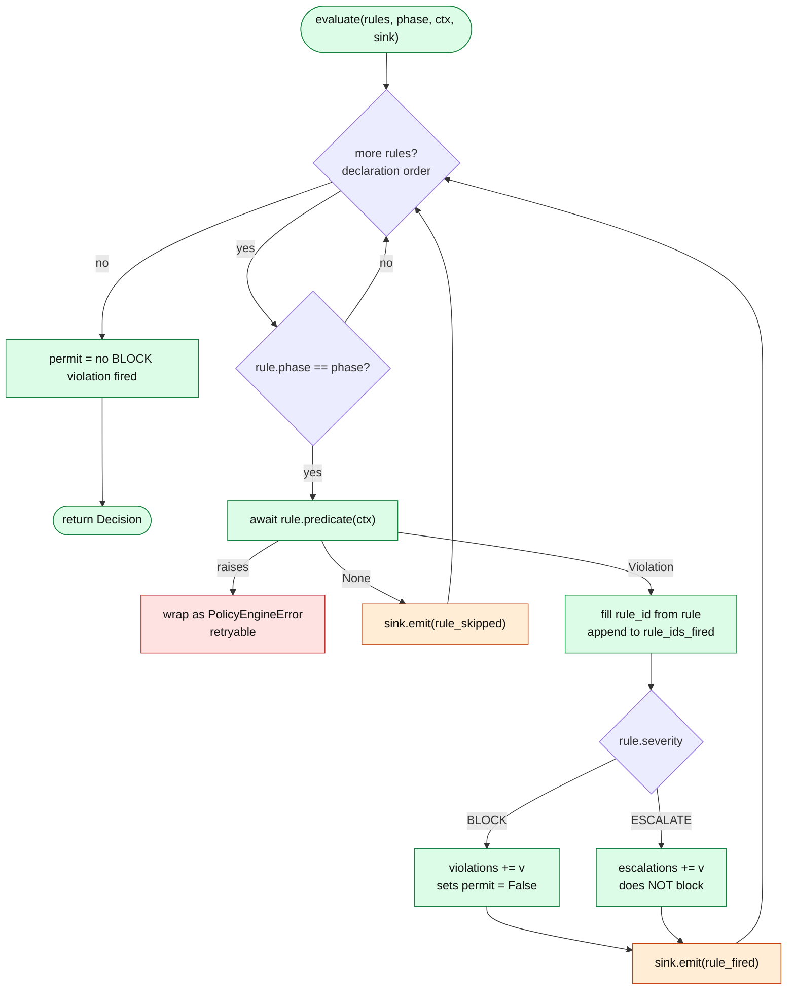
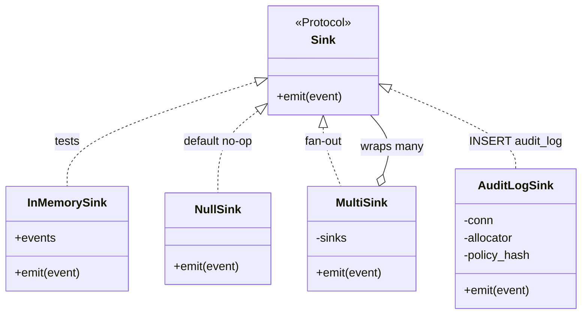

# `compass.policy` — module diagram

Mermaid view of the policy engine: how a rule is authored, how
`evaluate()` runs it, and where the result lands. For the end-to-end
workflow integration (Temporal activities, the five phases, audit row
lifecycle) see [`POLICY_ENGINE_DIAGRAM.md`](POLICY_ENGINE_DIAGRAM.md);
for design rationale see
[`superpowers/specs/2026-05-27-stage-5-policy-engine-design.md`](superpowers/specs/2026-05-27-stage-5-policy-engine-design.md).

## 1. The pieces and how they connect

Authoring (left) happens at import time; evaluation (right) happens once
per phase. The engine reads `RULES` + a `PolicyContext`, returns a
`Decision`, and emits one event per evaluated rule to a `Sink`.
`hash_rules` / `write_policy_snapshot` make the rule set reconstructable
from the `policy_hash` carried on every audit row.

## 2. Inside `evaluate()`

Walks rules in declaration order, runs each whose `phase` matches, emits
`rule_skipped` (predicate returned `None`) or `rule_fired` (returned a
`Violation`). `permit` is false only when a **BLOCK** rule fired;
ESCALATE surfaces a violation for human review but does not block. A
predicate that raises is wrapped as a retryable `PolicyEngineError`.

## 3. Sinks

One method — `async emit(event)`. The engine never imports psycopg; the
sink decides where events land. `AuditLogSink` turns each event into one
`audit_log` INSERT (sequence numbers from `SequenceAllocator`, idempotent
via `ON CONFLICT DO NOTHING`).

## 4. Error taxonomy

`retryable` is positive ("True means retry"); the activity boundary in
`workflows/send_invoice/activities.py` is the one place it is negated to
Temporal's `non_retryable=`.

| Error | Raised when | `retryable` |
| --- | --- | --- |
| `PolicyDecisionError` | A BLOCK/ESCALATE rule decided no | `False` — deterministic |
| `PolicyEngineError` | Predicate raised, primitive unregistered, malformed context | `True` |
| `PolicyInfraError` | Snapshot write / fact-loading hit Postgres outage | `True` |

## Vocabulary

Phase · Rule · Policy · Predicate · Primitive · Sink · Engine · Snapshot —
one sentence each in [`POLICY_ENGINE_DIAGRAM.md` §7](POLICY_ENGINE_DIAGRAM.md).
